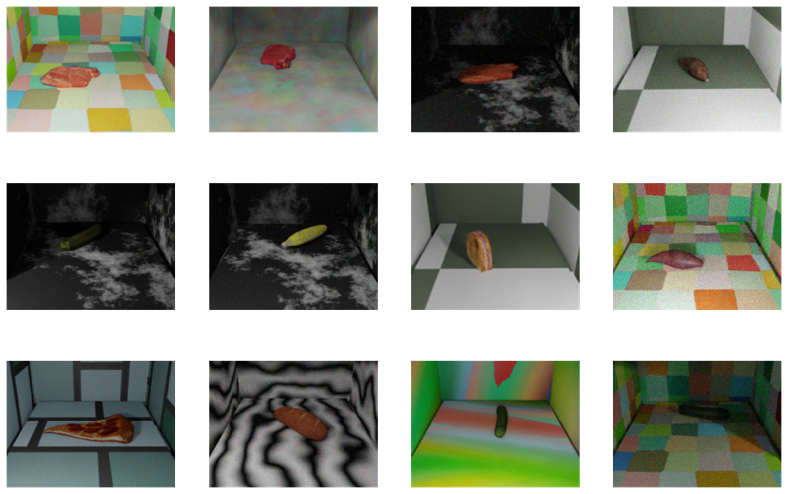

# 1.深度推定とセグメンテーションに用いるデータセットを作成
**生成されるデータセットの例**



- 背景（床と壁）の床上に食品のオブジェクトを位置・回転をランダムにして生成するコード
- RGB画像に対応した前景・背景のセグメンテーションと深度値（最小値0、最大値255になるように正規化）を出力する
- 背景（床と壁）のテクスチャはtex以下に10種類用意されており、0.png~9.pngという名前で保存されています

- オブジェクトの種類は変数obj_nameで示されます
- 一回のコード実行でオブジェクト１種類をレンダリングするので全てをレンダリングするには都度obj_nameを変更して実行する必要があります
- オブジェクトはobjディレクトリ以下にあり、以下の名前で保存されています
```sh
banana.obj - バナナ
bread.obj - パン
corn.obj - とうもろこし
pizza.obj - ピザ
sandwich.obj - サンドウィッチ
sweetpotato.obj - さつまいも
zucchini.obj - ズッキーニ
rawmeat.obj - 生肉
tomato.obj - トマト
peach.obj - 桃
pear.obj - 梨
```

**環境**
- ローカル環境推奨
- Mac(OS X)で動作確認
- python 3.7.13
- blenderproc 2.4.1
- numpy 1.19.2

**実行**
```sh
conda create -n py37 python=3.7 #python3.7なら不要(anaconda環境である必要はないです)
pip install blenderproc==2.4.1 numpy==1.19.2
blenderproc run datagen.py
```

- 
- mat_numは背景（床と壁）のテクスチャの数（変更不要）
- frは背景（床と壁）のテクスチャごとの生成枚数（変更不要）
- 論文の実験では11種類の食品に対して、10種類の背景で10枚ずつ作成したので、計1100枚作成
- 生成されたデータセットはkraz/students/2022/users/endo.rinta/synthetic.zipに保存あります
