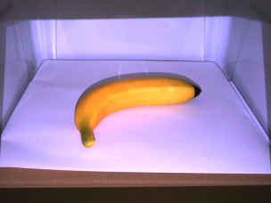
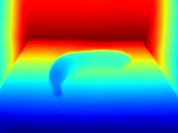

②深度推定
- 単一視点から深度推定を行うためのモデルを学習し、現実画像の推定を行うプログラムです

入力画像：

出力画像：


**環境**
- CUDA8.0
- pytorch 1.13.1
- torchaudio-0.13.1
- torchvision-0.14.1
- opencv-contrib-python
- scipy 1.7.3

**準備**
- data/synthetic/train or testに①で作成したデータを入れる（動作確認の場合不要）

構造：

data

|--synthetic

|-----train

|--------banana

|-----------0001.h5

|-----------…

|--------…

|-----val

|--------rawmeat

**実行**
```sh
conda create -n py37 python=3.7 #python3.7なら不要(anaconda環境である必要はありません)
conda activate py37
pip install torch torchvision torchaudio opencv-contrib-python six tqdm scipy h5py matplotlib
#apt-getでエラーが起きた場合
#sudo apt-key adv --fetch-keys https://developer.download.nvidia.com/compute/cuda/repos/ubuntu1804/x86_64/3bf863cc.pub
#sudo apt-get update
sudo apt-get install libgl1-mesa-dev -y
sudo apt-get install libglib2.0-0 -y
python train.py --gpu 0 --batch_size 8 --arch resnet --epochs 30 --lr 0.0001
python demo.py --input reals/ --gpu 0 --model results/synthetic_mask=False_arch=resnet_bs=8_lr=0.0001_ep=2_br=1_sd=1/network.pt
```

- results/synthetic_mask=False_arch=resnet_bs=8_lr=0.0001_ep=2_br=1_sd=1/demo_results内に深度画像が生成される


精度：
| Metrics | Values |
| ------ | ------ |
| thresh1 | 0.981 |
| thresh2 | 0.999 |
| thresh3 | 1.000 |
| abs_rel | 0.053 |
| sqr_rel | 0.001 |
| mae | 0.007 |
| rmse | 0.010 |
| log10 | 0.022 |
