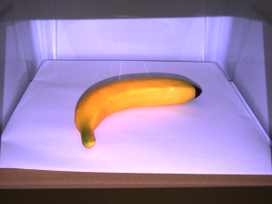
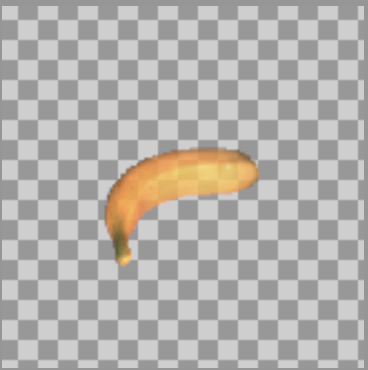

③セグメンテーション


入力画像：



出力画像：


- 単一視点から背景と前景を分割するフォアグラウンドセグメンテーションを学習させ、現実画像を推定
- セグメンテーション推定された画像と、②で作成された深度推定画像を合成
- 深度値は4チャンネル目に入力され、result以下に画像として出力される

**※学習済みモデルは保存されません**

**※②を実行していないと実行できません**
- ②で学習パラメータを変更した場合、segmentation.py21行目のdepthpathを生成されたモデルの名前に変更する必要があります
- **初期値：**'../2depth/results/synthetic_mask=False_arch=**resnet**_bs=**8**_lr=**0.0001**_ep=**2**_br=1_sd=1/demo_results/*_output.npy'

```sh
pip install segmentation-models tensorflow
python segmentation.py #AttributeErrorが出た場合は下の注意点を参照
```

**注意点：**
- /home/〇〇〇/.conda/envs/py37/lib/python3.7/site-packages/efficientnet/keras.py内の**init_keras_custom_objects**を**init_tfkeras_custom_objects**に変更(2箇所)
- 詳しくはhttps://stackoverflow.com/questions/75433717/module-keras-utils-generic-utils-has-no-attribute-get-custom-objects-when-imを参照
