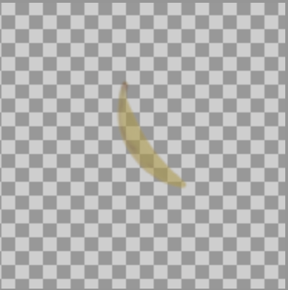
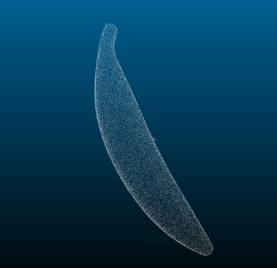

④データセット２作成
-背景透過RGBA画像（深度値はアルファチャンネルに入力されている）に対応する点群情報を含むデータセットを作成

背景透過RGBA画像：

点群情報：


- ローカル環境推奨
- Blender3.1.0を使用

レンダリング：
- model.blendを開いてアウトライナーからレンダリングするオブジェクトのカメラボタンを押してレンダリングに映るように設定

- レンダーメニューからアニメーションレンダリングを行う

レンダリング結果をdepth/GenerateData_◯◯◯/data/rendering以下に配置、3Dモデルをdepth/GenerateData_◯◯◯/data/model.objに配置

```sh
pip install trimesh scikit-learn
cd depth/GenerateData
python generate_data.py
```
- depth/GenerateData_◯◯◯/data/renderingに.datファイルが生成される
